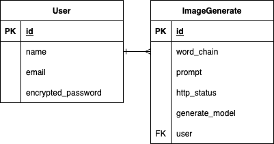

## アプリケーション名
しりとり画像ジェネレーター（Word Chain Image Generator）

## アプリケーション概要
ローマ字タイピングの練習ができるアプリケーションです。
しりとりの結果をプロンプトとして画像生成を行い、どんな画像ができるかを楽しみながらローマ字タイピングの習得に取り組むことができます。
画像生成機能が興味・動機づけとなり、プロンプトとなるしりとりをタイピング形式で行うことで結果的にローマ字タイピングの練習につながります。

## URL
https://word-chain-image-generator.onrender.com/

## 利用方法
- しりとりの単語をローマ字タイピングで入力し登録
- 5単語以上しりとりを続けて［画像生成］ボタンをクリックするとしりとり結果に応じた画像が生成される
- 詳細はトップページ内の［あそびかた］を参照
- ローマ字入力方法を確認したい場合は［ローマ字表］を参照
- スマートフォンなどのデバイスは仮想キーボードでタイピング可能

## アプリケーションを開発した背景
2020年より小学生から対象にラップトップ端末が貸与され幼少期からITリテラシーが求められる時代になりました。
PCを扱うためには基本的なキーボードタイピングが必要で、我が子に対し早いうちからキーボードタイピングを覚えさせることが大切だと考える親御さんも多くいます。
実際に私の長女がローマ字タイピングの習得ができず、かと言って「練習するのもつまらない！ローマ字も覚えたくない！！」
といった課題を抱えておりました...
ローマ字そのものを教えることはできるがなんとか主体的に学習につながる環境づくりをサポートできないか。
といった考えから **`子供たちがローマ字入力でのキーボードタイピングを習得しやすく、楽しく学べる環境を提供してITリテラシー向上のきっかけになることで世の中への貢献になれば`** という想いで企画、開発に至りました。

## 参考イメージ
- 物理キーボードからローマ字入力でしりとりの単語を登録


- 仮想キーボードから入力（タイピングミスのパターン）


- 画像生成例（2〜3分かかる場合があります）


- 遊び方のモーダルナビゲーションとローマ字表


## 実装予定の機能
- ユーザー管理機能（ペルソナが小学校低学年のためMVPリリースの段階では実装を劣後しました）
- スコアリング機能（しりとりを続けたくなる要素＝タイピング練習につながる要素として検討）
- 制限時間機能（ゲーム性を高める目的ですが、ペルソナ（小学校低学年）に対しては楽しめなくなる要素の可能性が高いため難易度選択の追加要素として検討）

## データベース設計


### usersテーブル
| Column             | Type    | Options                   |
| ------------------ | ------- | ------------------------- |
| id(PK)             | integer | null: false               |
| name               | string  | null: false               |
| email              | string  | null: false, unique: true |
| password           | string  | null: false               |
| encrypted_password | string  | null: false               |

### Association
- has_many :image_generates

### image_generatesテーブル
| Column         | Type       | Options                        |
| -------------- | ---------- | ------------------------------ |
| id(PK)         | integer    | null: false                    |
| word_chain     | text       | null: false                    |
| prompt         | text       | null: false                    |
| http_status    | integer    | null: false                    |
| generate_model | string     | null: false                    |
| user(FK)       | references | null: false, foreign_key: true |

### Association
- belongs_to :user

## 開発環境
| カテゴリ                     | 技術内容                                                                                      |
| ---------------------------- | --------------------------------------------------------------------------------------------- |
| フロントエンド               | HTML/CSS, Tailwind CSS, JavaScript                                                            |
| バックエンド                 | Ruby 3.2.0, Rails 7.0.8.1, PostgreSQL 14.10                                                   |
| インフラ                     | Render                                                                                        |
| ファイルサーバー             | AWS S3                                                                                        |
| API                          | StableDiffusion API（Hugging Face）, GAS翻訳API（自作）, Twitter API, Tiny_URL（短縮URL生成） |
| バージョン管理               | Git/GitHub                                                                                    |
| CI/CD                        | CI：GitHub Actions, CD：Render                                                                |
| ワイヤーフレーム, ER図 | Figma, drow.io                                                                                |


## ローカルでの動作方法
※ 画像生成をするために別途Hugging FaceでAPI Keyを取得し **`STABLE_DIFFUSION_API_KEY`** として環境変数化が必要です。
API取得方法は以下リンクへアクセスし「 **`Stable DiffusionのAPI取得方法`** 」の見出し（1）を参照ください。
https://zenn.dev/no215/articles/9490defad6948b
```zsh:ターミナル
% git clone
% cd 
% bundle install
% vim ~/.zshrc
% source ~/.zshrc
```

## 工夫したポイント
- レスポンシブ対応するために仮想キーボードを導入しました。PCを携行しない外出時でもスマートフォンでローマ字タイピング入力ができます。
- ローマ字をすぐに確認できるようにモーダル形式でローマ字表を実装しました。
- 画像生成のリクエスト制限（429エラー）やサーバーエラー（500, 503）の対策として指数バックオフ方式（2秒〜32秒、最大5回）でリトライを行うロジックにしました。
- ペルソナ（小学校低学年）に向けては不要な機能ですが、サービスのユーザースケールを目的としてSNS（X）へのシェア機能を実装しました。
- 画像生成機能において適切な生成AIモデルを選択し、ネガティブプロンプトをあらかじめ組み込むことで極力不適切な画像を生成させない仕様としました。
- しりとりのルールにおける拗音（「しゃ」など）や長音（「ー」）または拗音＋長音（「シャー」など）で単語が終わる場合の次の単語の頭文字の扱いに配慮しました。（例：「ゃ」で始まる単語を求めない）
- テストコード実装においてテストのたびに画像生成APIを叩く処理をエミュレートし外部APIによる依存を制御することでテストの安定性を向上させました。

## 改善点
- 画像生成に関してリクエスト制限対策を講じたい。Stable Diffusionのレート制限に達した場合は代替先となる別のAPIへリクエストを行うことで画像生成エラーの可能性を減らしUX向上に繋げたい。
- 画像生成に使用するプロンプトとして不適切な単語を排除することでアプリケーションの信頼性と安全性を高めたい。

## 制作時間
- 2024年4月1日時点でトータル105時間
  - MVPリリースで50時間ほど
  ### MVPリリース時点での実装機能
    - タイピング機能
      - タイピング正誤判定
      - 仮想キーボード実装
      - 物理キーボードとの連動
    - しりとり機能
      - 既出単語の判定
      - 頭文字の正誤判定
    - 画像生成機能
